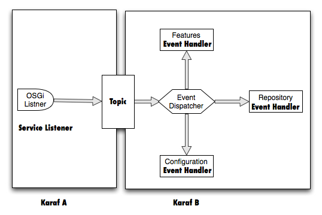

+++
title = "Karaf clustering using Hazelcast"
author = ["Ioannis Canellos"]
date = 2011-03-11T00:00:00+02:00
draft = false
+++

****EDIT****: The project “cellar” has been upgraded with a lot new features, which are not described by this post. A new post will be added soon.

## Prologue {#prologue}

I have been playing a lot with [Hazelcast](https://hazelcast.com/) lately, especially pairing it with Karaf. If you haven’t done already you can read my previous post on using Hazelcast on Karaf.

In this post I am going to take things one step further and use Hazelcast to build a simple clustering engine on Karaf.

The engine that I am going to build will have the following features:

-   ****Zero configuration clustering****
    -   Node discover each other with no config
-   ****Configuration Replication****
    -   muslticasting configuration change events
    -   configurable blacklist/whitelist by PID
    -   lifecycel support (can be enabled/disabled using shell)
-   ****Features Repository &amp; State replication****
    -   multicasting repository events (add url and remove url).
    -   multicasting features state events.
    -   configurable blacklist / whitelist by feature.
    -   lifecycle support (can be enabled/disabled using shell).
-   ****Clustering management****
    -   distributed command pattern implementation.
    -   monitoring and management commands.

## Architecture {#architecture}

The idea behind the clustering engine is that for each unit that we want to replicate, we create an event, broadcast the event to the cluster and hold the unit state to a shared resource, so that the rest of the nodes can look up and retrieve the changes.



****Example****: We want all nodes in our cluster to share configuration for PIDs a.b.c and x.y.z. On node “Karaf A” a change occurs on a.b.c. “Karaf A” updates the shared repository data for a.b.c and then notifies the rest of the nodes that a.b.c has changed. Each node looks up the shared repository and retrieves changes.

## The role of Hazelcast {#the-role-of-hazelcast}

The architecture as described so far could be implemented using a database/shared filesystem as a shared resource and polling instead of multicasting events. So why use Hazelcast?
Hazelcast fits in perfectly because it offers:

-   ****Auto discovery****
    -   Cluster nodes can discover each other automatically.
    -   No configuration is required.
-   ****No single point of failure****
    -   No server or master is required for clustering.
    -   The shared resource is distributed, hence we introduce no single point of failure.
-   ****Provides distributed topics****
    -   Using in memory distributed topics allows us to broadcast events / commands the are valuable for management and monitoring.

### The implementation {#the-implementation}

For implementing all the above we have the following entities:

#### OSGi Listener {#osgi-listener}

An interface the implements a listener for specific OSGi events (e.g. ConfigurationListener)

#### Event {#event}

The object that contains all the required information required to describe the event (e.g. PID changed).

#### Event Topic {#event-topic}

The distributed topic use to broadcast events. It is common for all event types.

#### Shared Map {#shared-map}

The distributed collection the serves as shared resource. We use one per event type.

#### Event Handler {#event-handler}

The processor the processes remote event received through the topic.

#### Event Dispatcher {#event-dispatcher}

The unit the decides which event should be processed by which event handlers.

#### Command {#command}

A special type of event that is linked to a list of events that represent the outcome of the command.

#### Result {#result}

A special type of event that represents the outcome of a command. Commands and results are correlated.

The OSGi spec in a lot of situations describe Events and Listener (e.g. ConfigurationChangeEvent and ConfigurationListener).By implementing such Listener and expose it as an OSGi service to the Service Registry I make sure that we “listen” to the events of interest.

When the listener is notified of an event it forwards the Event object to a Hazel cast distributed topic. To keep things as simple as possible I keep a single topic for all event types. Each node has a listener registered on that topic and gets sends all events to the event Dispatcher.

The Event Dispathcer when receives an event it looks up an internal registry (in our case the OSGi Service Registry), in order to find and Event Handler that can handle the received Event. If a handler is found then it receives the event and processes it.

## Broadcasting commands {#broadcasting-commands}

Commands are a special kind of events. They imply that when they are handled a Result event will be fired, that will contain the outcome of the command. So for each command we have one result per recipient. Each command contains a unique id (unique foe all cluster nodes, create from Hazelcast). This id is used to correlate the request with the result. For each result successfully correlated the result is added to list of results on the command object. If the list gets full or if 10 seconds from the command execution have elapsed, the list is moved to a blocking queue from which the result can be retrieved.

The snippet below shows what happens when a command is sent for execution.

## Using the source {#using-the-source}

I created a small project that demonstrates all of the functionality described above and have uploaded it to github, so that I can share it with you, receive feedback and discuss about it. The project is called cellar. I couldn’t find a more appropriate name to give to a cluster of Karafs.

Once you build the source you can install it as a karaf feature and then you are ready to use the cluster shell commands.



In the image above I start two karaf instances, I install cellar to both and then I list the cluster members and I disable the configuration event handler of the first node.
The rest is up to you to explore,
Enjoy!
