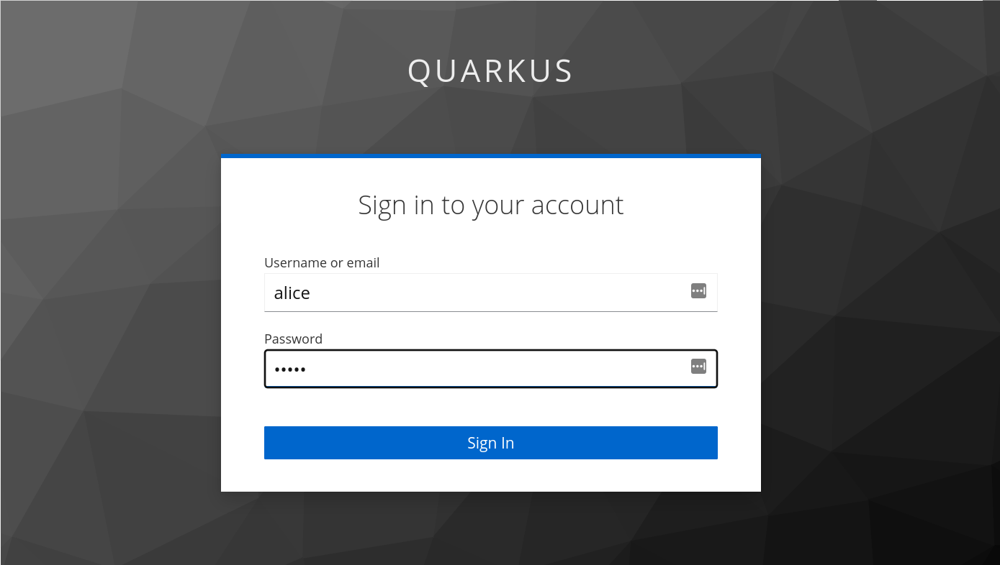

+++
title = "Quarkus React with Quinoa and Keycloak"
author = ["Ioannis Canellos"]
description = "How to create Quarkus powered react applications that use Keycloak via DevServices"
date = 2022-10-17T14:36:00+03:00
draft = false
+++

## Introduction {#introduction}

This year I decided to put some personal time in learning [reactjs](https://reactjs.org/). While I enjoy using Javascript for the frontend, I'd say that it's not the language of choice for me for backend use.
I don't have anything against [nodejs](https://nodejs.org), but I prefer use java frameworks, which is the focus of my day job. So, I wanted to combine [reactjs](https://reactjs.org/) with [Quarkus](https://quarkus.io/). A combination that just became
more fun with the [Quinoa](https://quarkiverse.github.io/quarkiverse-docs/quarkus-quinoa/dev/). [Quinoa](https://quarkiverse.github.io/quarkiverse-docs/quarkus-quinoa/dev/) allows users to use their favorite javascript framework with [Quarkus](https://quarkus.io/) with no additional configuration. On top of that it allows development of both
backend and fronted from via the [Quarkus](https://quarkus.io/)  dev mode. Last but not least it allows for native compilation that produces a single binary containing both fronted and backend.

This post demonstrates development using [Quinoa](https://quarkiverse.github.io/quarkiverse-docs/quarkus-quinoa/dev/). To make things more interesting it adds security into the mix. In particular it uses [Keycloak](https://www.keycloak.org/) as an identity provider and shows how
frontend and backend can exchange information is a secure way.

The end result is something like:



The full project can be found at: <https://github.com/iocanel/quarkus-react-keycloak>

**Credits:** The following demo <https://github.com/dasniko/keycloak-reactjs-demo> by [Niko Kobler](https://github.com/dasniko) was really helpful and influencial for this post.


## Challenges {#challenges}

The main challenges that such a setup faces and addressed in this blog are:

-   Starting [Keycloak](https://www.keycloak.org/) dev service configured with a public client (for frontend use).
-   [Keycloak](https://www.keycloak.org/) discovery from the frontend.
-   Frontend/backend communication using the token obtained from [Keycloak](https://www.keycloak.org/)


## Getting started with Quinoa {#getting-started-with-quinoa}

To create an empty [Quarkus](https://quarkus.io/)  project using the [Quinoa](https://quarkiverse.github.io/quarkiverse-docs/quarkus-quinoa/dev/) extension:

```sh
mkdir -p ~/demo
cd ~/demo
quarkus create app quarkus-react-keycloak -x=io.quarkiverse.quinoa:quarkus-quinoa
cd quarkus-react-keycloak
```

The generated project has the structure shown below. It's a regular [Quarkus](https://quarkus.io/) application with the addition of \`webui\` under \`src/main\`:



The \`webui\` folder is a traditional Javascript project.


## Add the extensions for keycloak {#add-the-extensions-for-keycloak}

To be able to access the [Keycloak](https://www.keycloak.org/) Dev Services, we'll need the following extension.

```sh
quarkus ext add -B oidc
quarkus ext add -B keycloak-authorization
```

Now, by running the application in dev mode, the [Keycloak](https://www.keycloak.org/) Dev Service is automatically started:

```sh
./mvnw quarkus:dev
```


## Exposing Keycloak to the fronted {#exposing-keycloak-to-the-fronted}

The Dev Service for [Keycloak](https://www.keycloak.org/) passes as properties all configuration information needed for interaction with the service.
The fronted however, is completely unaware. Let's expose the information via rest. So, let's add the \`quarkus-resteasy-reactive-jackson\` extension:

```sh
quarkus ext add -B resteasy-reactive-jackson
```

Now, let's add a resource that exposes [Keycloak](https://www.keycloak.org/) information.
The info we need to expose is:

-   The url
-   The realm
-   The clientId

<!--listend-->

```java
package org.acme;

 public class KeycloakInfo {

     private final String url;
     private final String realm;
     private final String clientId;

     public KeycloakInfo(String url, String realm, String clientId) {
          this.url = url;
          this.realm = realm;
          this.clientId = clientId;
      }

      public String getUrl() {
          return url;
      }

      public String getRealm() {
          return realm;
      }

      public String getClientId() {
          return clientId;
      }
  }
```

In theory we can live with just the \`url\` (it's the only thing that is dynamic) and hardcode the rest in fronted.
Let's create a rest resource that uses the path \`/api/keycloak/info.json\` to expose the \`Keycloak\` info.
That resource obtains the \`url\`, and  \`clientId\` from the configuration populated by the Dev Service using the \`@ConfigurationProperty\` annotation.

```java
package org.acme;

import javax.ws.rs.GET;
import javax.ws.rs.Path;
import javax.ws.rs.Produces;
import javax.ws.rs.core.MediaType;

import org.eclipse.microprofile.config.inject.ConfigProperty;

@Path("/api/keycloak")
public class KeycloakResource {

  @ConfigProperty(name="keycloak.url")
  String keycloakUrl;

  String realm="quarkus";

  @ConfigProperty(name="quarkus.oidc.client-id")
  String clientId;

  @GET
  @Path("info.json")
  @Produces(MediaType.APPLICATION_JSON)
  public KeycloakInfo getInfo() {
    return new KeycloakInfo(keycloakUrl, realm, clientId);
  }
}
```

By accessing <http://localhost:8080/api/keycloak/info.json> you get something similar to:

```json
{
 url: "http://localhost:43749",
 realm: "quarkus",
 clientId: "quarkus-app"
}
```

Before demonstrating what exactly we are going to do with this blob of json in the frontend, let's configure which paths served by the front and which by the backend.


## Single application routing {#single-application-routing}

To configure the routes served by the backend, let's set \`quarkus.quinoa.enable-spa-routing\` to true.

```sh
echo "quarkus.quinoa.enable-spa-routing=true" >> src/main/resources/application.properties
```


## Setup the react application {#setup-the-react-application}

Let's just delete the \`webui\` folder for now and create a new [reactjs](https://reactjs.org/) application from scratch:

```sh
rm -r src/main/webui
cd src/main
yarn create react-app webui
cd webui
```

An alternative is to use a react template. I usually go with <https://github.com/iotemplates/react-template> which is a simple todo app
and is setup with tests, github actions etc.


## Add dependencies {#add-dependencies}

We need two additional dependencies:

-   [axios](https://github.com/axios/axios)
-   [keycloak-js](http://keycloak.org)
    ```sh
      npm install --save axios
      npm install --save keycloak-js
    ```


## Configuring the Keycloak client in Javascript {#configuring-the-keycloak-client-in-javascript}

To initialize the [keycloak](https://www.keycloak.org/) javascript client we need to fetch the \`info.json\` from the backend and pass it to the constructor.
Then it's just a matter of calling the \`init\` function with the proper configuration:

```javascript
let keycloak;
fetch(`http://localhost:8080/api/keycloak/info.json`)
    .then(response => response.json()).then(json => {
    keycloak = new Keycloak(json);
    keycloak.init({
        onLoad: 'check-sso',
        silentCheckSsoRedirectUri: window.location.origin + '/silent-check-sso.html',
        pkceMethod: 'S256',
        checkLoginIframe: false,
    }};
});
```

The java developer in me feels compelled to encapsulate the [keycloak](https://www.keycloak.org/) client so, let's wrap it in a class:

```javascript
import Keycloak from 'keycloak-js';

class KeycloakService {
  #keycloak;
  init(onAuthenticated) {
    fetch(`http://localhost:8080/api/keycloak/info.json`)
          .then(response => response.json()).then(json => {
      this.#keycloak = new Keycloak(json);
      this.#keycloak.init({
        onLoad: 'check-sso',
        silentCheckSsoRedirectUri: window.location.origin + '/silent-check-sso.html',
        pkceMethod: 'S256',
        checkLoginIframe: false,
      }).then((authenticated) => {
        console.log("User:" + (authenticated ? this.getUsername() : "anonymous."));
        if (onAuthenticated) {
          onAuthenticated();
        }
      }).catch(console.error);
    });
  }

  login() {
    this.#keycloak.login();
  }

  logout() {
    this.#keycloak.logout();
  }

  updateToken(callback) {
    this.#keycloak.updateToken(5).then(callback).catch(() => this.login());
  }

  getToken() {
    return this.#keycloak?.token;
  }

  getUsername() {
    return this.#keycloak.idTokenParsed?.upn;
  }

  isAuthenticated() {
    return !!this.getToken();
  }

  hasRole(roles) {
    return roles.some((role) => this.getRoles().includes(role));
  }
  getRoles() {
    return this.#keycloak.idTokenParsed?.upn;
  }
}

export const userService = new KeycloakService();
export const getToken = () => userService.getToken();
export const updateToken = (callback) => userService.updateToken(callback);

const UserService = {
  userService,
  getToken,
  updateToken
}
export default UserService;
```

Note, the \`login\` method. Calling that redirects users to the [Keycloak](https://www.keycloak.org/) login screen.

However, there is a detail that needs shorting out. The client needs to authenticate itself.
Client authenticates with the use of a \`clientSecret\` or by configuring the [Keycloak](https://www.keycloak.org/) realm to allow for public clients.
Given, that we are talking about the fronted, there is not much sense to use a secret so we need to configure the
realm as private.


## Configuring the realm {#configuring-the-realm}

Out of the box, the [Keycloak](https://www.keycloak.org/) Dev Services will create a realm with some sensible defaults. The generated realm however, does not allow public clients and also imposed some limitations on which are the origins allowed to use the service.
Another options is to \`bring your own realm\`.
The [provided realm](https://raw.githubusercontent.com/iocanel/quarkus-react-keycloak/main/src/main/resources/quarkus-realm.json) is ready to use. The only difference from the generated one, are the customization mentioned above. Additional customization is possbile by logging to the [Keycloak](https://www.keycloak.org/) instance as admin. The instance itself is accessible through the [Quarkus](https://quarkus.io/) Dev UI \`<http://localhost:8080/q/dev>\`.



By default the admin credentials are \`admin\` / \`admin\`.

After customization, the realm can be exported and passed to the Dev Service configuration.

In case you provide your own realm, make sure to also set \`quarkus.keycloak.devservices.realm-path=<span class="org-target" id="org-target--path-to-keycloak-realm-json"></span>\` in the \`application.properties\`.


## The login process {#the-login-process}

With the realm properly configured, the \`login\` method of \`KeycloakService\` provided above, will bring up the login screen.


The [provided realm](https://raw.githubusercontent.com/iocanel/quarkus-react-keycloak/main/src/main/resources/quarkus-realm.json) comes with a user named \`alice\` that use \`alice\` as a password.

The only thing left is to configure the [reactjs](https://reactjs.org/) routes, so that login initiates, when the user is anonymous and tries to visit protected pages (e.g. \`/dashboard\` or \`profile\`). In jsx this is expressed like:

```javascript
import { BrowserRouter as Router, Routes, Route, Link } from "react-router-dom";

export default function App() {
  return (
    <Router>
      <MenuBar />
      <Routes>
        <Route exact path="/" element={<Home />} />

        <Route path="/dashboard" element={<PrivateRoute />}>
          <Route path="/dashboard" element={<Dashboard />} />
        </Route>

        <Route path="/profile" element={<PrivateRoute />}>
          <Route path="/profile" element={<Profile />} />
        </Route>

      </Routes>
    </Router>
  );
}
```

The code is pretty straight forward, with only exception the \`PrivateRoute\`. The \`PrivateRoute\` is custom component that encapsulates
The authentication logic. It uses the \`userService\` (which is actually the \`KeycloakService\` implemented previously) to check if user is logged in.
If not, then the login process starts. In the opposite case the \`Outlet\` is displayed.

```javascript
import { useEffect } from 'react';
import { Outlet } from 'react-router-dom';
import { userService } from '../services/UserService';

export default function PrivateRoute () {
  useEffect(() => {
    if (!userService.isAuthenticated()) {
      userService.login();
    }
  }, []);
  return userService.isAuthenticated() && <Outlet />;
}
```


## Secure frontend / backend communication {#secure-frontend-backend-communication}

Securing things only the frontend is no good, if the backend is not.
To secure the backend we need to two things:

-   express which users / roles allowed to access which paths.
-   pass authentication token obtained by [Keycloak](https://www.keycloak.org/) to the backend.

The former is trivial as [Quarkus](https://quarkus.io/) provides the security mechanism to support that.
So, to get the profile information the backend, we can have a resource that allows authenticated users to grab the user info from the \`SecurityIdentiy\`;

```java
package org.acme;

import java.util.Set;

import javax.annotation.security.RolesAllowed;
import javax.inject.Inject;
import javax.ws.rs.GET;
import javax.ws.rs.Path;
import javax.ws.rs.Produces;
import javax.ws.rs.core.MediaType;

import org.jboss.resteasy.reactive.NoCache;

import io.quarkus.security.identity.SecurityIdentity;

@Path("/api/user")
public class UserResource {

    @Inject
    SecurityIdentity identity;

    @GET
    @Path("/me")
    @Produces(MediaType.APPLICATION_JSON)
    @RolesAllowed("user")
    @NoCache
    public User me() {
        return new User(identity);
    }

    public static class User {

        private final String userName;
        private final Set<String> roles;

        User(SecurityIdentity identity) {
            this.userName = identity.getPrincipal().getName();
            this.roles = identity.getRoles();
        }

        public String getUserName() {
            return userName;
        }

        public Set<String> getRoles() {
			      return roles;
		    }
    }
}
```

The other part, requires a little bit work on the frontend side of things so that http request to the backend include the \`Bearer\` header with
the token as value.

For http, this blog is using [axios](https://github.com/axios/axios). Let's create a simple factory that creates an [axios](https://github.com/axios/axios) client.
The factory uses two callback functions:

-   getToken: to fetch the actual token.
-   updateToken to update the token

The factory also defines the interceptor that sets the \`Bearer\` and refreshes the token when needed.

```javascript
import axios from "axios";

const create = (getToken, updateToken) => {
  const client = axios.create();
  client.interceptors.request.use((config) => {
    let token = getToken();
    //Check if authenticated.
    if (token != null && token.length > 0) {
      const callback = () => {
        config.headers.Authorization = `Bearer ${getToken()}`;
        return Promise.resolve(config);
      };
      updateToken(callback);
    }
    return config;
  });
  return client;
}

const AxiosFactory =  { create }
export default AxiosFactory;
```


## The profile component {#the-profile-component}

To demonstrate how the [axios](https://github.com/axios/axios) client is used in action let's take a closer look at the profile component.
The component when created, it uses the \`AxiosFactory\` to create [axios](https://github.com/axios/axios). It passes the token callbacks
provided by the \`UserService\` shown above. Then it uses the client to fetch users and roles from the \`/api/user/me\`
that we just coded in the backed.

```javascript
import { React, useState, useEffect } from 'react';
import { getToken, updateToken } from './services/UserService';
import AxiosFactory from './services/AxiosFactory';

function Profile() {

  const [username, setUsername] = useState();
  const [roles, setRoles] = useState([]);

  useEffect(() => {
    const axios = AxiosFactory.create(getToken, updateToken);
    axios.get('http://localhost:8080/api/user/me').then(res => res.data).then(data => {
      setUsername(data.userName);
      setRoles(data.roles);
    });
  }, []);

  return (
    <div>
      <div>
        <h2>Profile</h2>
        <p>This is the profile page. The purpose of the page is to demonstrate how to access a secure resource in the backed.</p>
        <p>The information below is retrieved via http by passing bearer token retrieved from the user service.</p>
        <div>
          <label>Username:</label> {username}
        </div>
        <div>
          <label>Roles:</label>
          <ul>
            {roles.map(role => <li>{role}</li>)}
          </ul>
        </div>
      </div>
    </div>
  );
```

The page should look like:




## Closing Thoughts {#closing-thoughts}

Using [Quarkus](https://quarkus.io/) with [Quinoa](https://quarkiverse.github.io/quarkiverse-docs/quarkus-quinoa/dev/) simplifies working with javascript framework a lot as it uses a single project, build tool and development to work with everything.
Dev Services further simplifies integration with external services, as developers no longer have to setup services by hand, docker compose etc.
[Keycloak](https://www.keycloak.org/) provides a great way to deal with authentication, token etc by lifting that burden of the developers shoulder.
